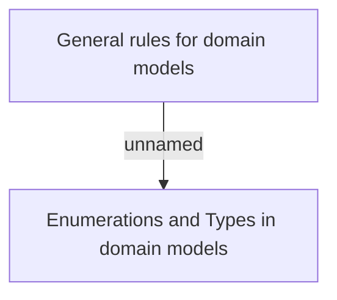

# General rules for system documentation

```mermaid
graph TD
    General_rules_for_domain_models["General rules for domain models"]
    Enumerations_and_Types_in_domain_models["Enumerations and Types in domain models"]
    General_rules_for_domain_models -->|unnamed| Enumerations_and_Types_in_domain_models
```
