# General rules for system behavior

- **Diagram Type**: Custom
- **Package**: HomerSelect/BSL/Analysis Model/_General Rules/System behavior
- **Diagram ID**: 152997
- **Elements**: 19
- **Connectors**: 17

```mermaid
graph TD
    ADD_Max_tabs_for_role["{ADD}Max tabs for role"]
    ADD_Number_of_tabs["{ADD}Number of tabs"]
    MOD_Support_of_multitab["{MOD}Support of multitab"]
    Data_refresh_after_insert_or_update_a_records["Data refresh after insert or update a records"]
    Rules_for_modal_forms["Rules for modal forms"]
    Use_case_for_printing["Use case for printing"]
    Concurrent_data_modification["Concurrent data modification"]
    Displaying_tooltips["Displaying tooltips"]
    Forms_for_data_input["Forms for data input"]
    Tabs_on_form_displaying["Tabs on form displaying"]
    Enumerations_in_list_boxes["Enumerations in list boxes"]
    Rules_for_text_searching["Rules for text searching"]
    General_rules_for_user_interfaces["General rules for user interfaces"]
    Reset_button_in_search_forms["Reset button in search forms"]
    Validation_of_form_data["Validation of form data"]
    Use_cases_for_searching_functions["Use cases for searching functions"]
    Application_buttons_availability["Application buttons availability"]
    Access_rights_and_use_cases["Access rights and use cases"]
    General_rules_for_use_cases["General rules for use cases"]
    General_rules_for_user_interfaces -->|unnamed| Rules_for_text_searching
    General_rules_for_user_interfaces -->|unnamed| Data_refresh_after_insert_or_update_a_records
    General_rules_for_use_cases -->|unnamed| Rules_for_modal_forms
    General_rules_for_use_cases -->|unnamed| Use_case_for_printing
    General_rules_for_use_cases -->|unnamed| Concurrent_data_modification
    General_rules_for_user_interfaces -->|unnamed| Displaying_tooltips
    General_rules_for_user_interfaces -->|unnamed| Forms_for_data_input
    General_rules_for_user_interfaces -->|unnamed| MOD_Support_of_multitab
    General_rules_for_user_interfaces -->|unnamed| Enumerations_in_list_boxes
    ADD_Number_of_tabs -->|unnamed| ADD_Max_tabs_for_role
    General_rules_for_user_interfaces -->|unnamed| Reset_button_in_search_forms
    General_rules_for_use_cases -->|unnamed| Validation_of_form_data
    General_rules_for_use_cases -->|unnamed| Use_cases_for_searching_functions
    General_rules_for_user_interfaces -->|unnamed| Application_buttons_availability
    General_rules_for_use_cases -->|unnamed| Access_rights_and_use_cases
    MOD_Support_of_multitab -->|unnamed| ADD_Number_of_tabs
    General_rules_for_user_interfaces -->|unnamed| Tabs_on_form_displaying
```

