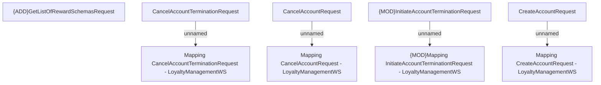

# LoyaltyManagementWS - mapping rules

- **Diagram Type**: Custom
- **Package**: HomerSelect/BSL/Analysis Model/_Interface/Consumed services/Loyalty system/Mapping rules
- **Diagram ID**: 81756
- **Elements**: 9
- **Connectors**: 4

