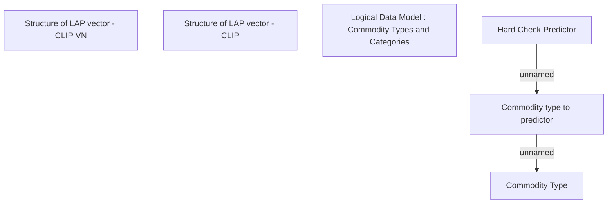

# Commodity Hard Check Predictor

```mermaid
graph TD
    Structure_of_LAP_vector_CLIP_VN["Structure of LAP vector - CLIP VN"]
    Structure_of_LAP_vector_CLIP["Structure of LAP vector - CLIP"]
    Logical_Data_Model_Commodity_Types_and_Categories["Logical Data Model : Commodity Types and Categories"]
    Hard_Check_Predictor["Hard Check Predictor"]
    Commodity_type_to_predictor["Commodity type to predictor"]
    Commodity_Type["Commodity Type"]
    Commodity_type_to_predictor -->|unnamed| Commodity_Type
    Hard_Check_Predictor -->|unnamed| Commodity_type_to_predictor
```
