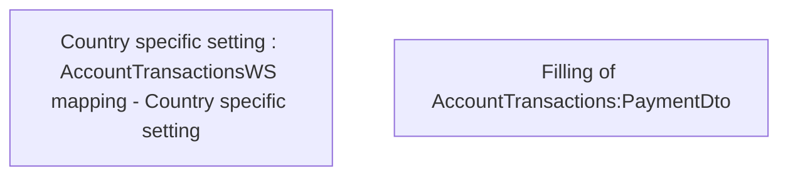

# Account Transactions - Mapping rules

- **Diagram Type**: Custom
- **Package**: HomerSelect/BSL/Analysis Model/_Interface/Mapping to external systems/Payment card system/Account Transactions/Business rules
- **Diagram ID**: 70937
- **Elements**: 2
- **Connectors**: 0

