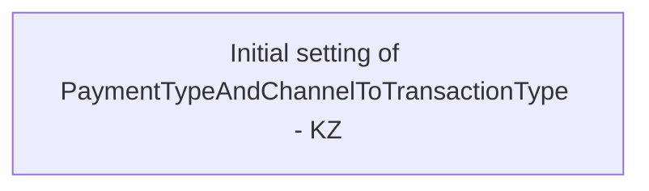

# AccountTransactionsWS mapping - Country specific setting

- **Diagram Type**: Custom
- **Package**: HomerSelect/BSL/Analysis Model/_Interface/Mapping to external systems/Payment card system/Account Transactions/Country specific setting
- **Diagram ID**: 63203
- **Elements**: 1
- **Connectors**: 0

