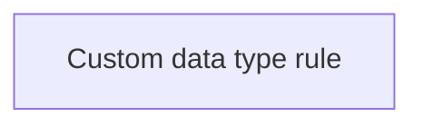

# Business rules

- **Diagram Type**: Custom
- **Package**: HomerSelect/BSL/Analysis Model/_Interface/Provided Data sources/Business rules
- **Diagram ID**: 129054
- **Elements**: 1
- **Connectors**: 0

