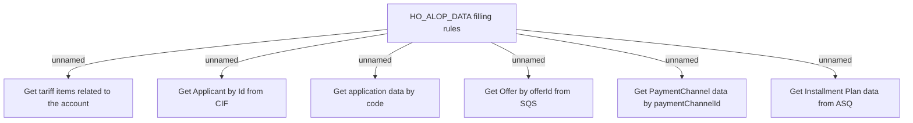

# HO_ALOP_DATA - getting external data

- **Diagram Type**: Custom
- **Package**: HomerSelect/BSL/Analysis Model/_Interface/Provided Data sources/Logical Data Model/Common/HO_ALOP_DATA
- **Diagram ID**: 164467
- **Elements**: 7
- **Connectors**: 6

