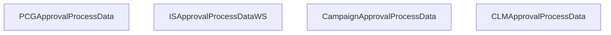

# Application Evaluation

- **Diagram Type**: Custom
- **Package**: HomerSelect/BSL/Analysis Model/_Interface/Provided Web Services/Application Evaluation
- **Diagram ID**: 112075
- **Elements**: 4
- **Connectors**: 0

