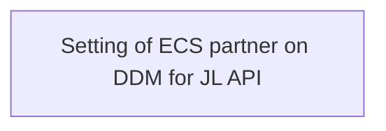

# Business rules

- **Diagram Type**: Custom
- **Package**: HomerSelect/BSL/Analysis Model/_Interface/Setting of ECS partner on DDM for JL API/PAYM/Business rules
- **Diagram ID**: 113386
- **Elements**: 1
- **Connectors**: 0

