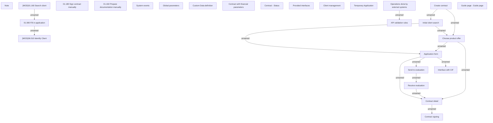

# Loan origination funcionality

```mermaid
graph TD
    Contract_signing["Contract signing"]
    el_1811880["Note"]
    MOD_01_160_Search_client["{MOD}01.160 Search client"]
    n_01_180_Sign_contract_manually["01.180 Sign contract manually"]
    n_01_182_Prepare_documentation_manually["01.182 Prepare documentation manually"]
    MOD_06_010_Identify_Client["{MOD}06.010 Identify Client"]
    n_01_080_Fill_in_application["01.080 Fill in application"]
    System_events["System events"]
    Global_parameters["Global parameters"]
    Custom_Data_definition["Custom Data definition"]
    Contract_with_financial_parameters["Contract with financial parameters"]
    Contract_Status["Contract - Status"]
    Interface_with_CIF["Interface with CIF"]
    Provided_interfaces["Provided interfaces"]
    Client_management["Client management"]
    Temporary_Application["Temporary Application"]
    API_validation_rules["API validation rules"]
    Receive_evaluation["Receive evaluation"]
    Send_to_evaluation["Send to evaluation"]
    Operations_done_by_external_systems["Operations done by external systems"]
    Choose_product_offer["Choose product offer"]
    Contract_detail["Contract detail"]
    Application_form["Application form"]
    Initial_client_search["Initial client search"]
    Create_contract["Create contract"]
    Guide_page_Guide_page["Guide page : Guide page"]
    Create_contract -->|unnamed| Initial_client_search
    Choose_product_offer -->|unnamed| Application_form
    Initial_client_search -->|unnamed| Application_form
    Receive_evaluation -->|unnamed| Contract_detail
    Application_form -->|unnamed| Contract_detail
    Choose_product_offer -->|unnamed| Contract_detail
    Initial_client_search -->|unnamed| Choose_product_offer
    Create_contract -->|unnamed| Choose_product_offer
    Application_form -->|unnamed| Send_to_evaluation
    Send_to_evaluation -->|unnamed| Receive_evaluation
    Operations_done_by_external_systems -->|unnamed| API_validation_rules
    Application_form -->|unnamed| Interface_with_CIF
    MOD_01_160_Search_client -->|unnamed| n_01_080_Fill_in_application
    Contract_detail -->|unnamed| Contract_signing
    n_01_080_Fill_in_application -->|unnamed| MOD_06_010_Identify_Client
```
