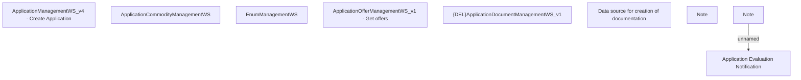

# Interfaces

```mermaid
graph TD
    ApplicationManagementWS_v4_Create_Application["ApplicationManagementWS_v4 - Create Application"]
    ApplicationManagementWS_v4_Create_Application["ApplicationManagementWS_v4 - Create Application"]
    ApplicationCommodityManagementWS["ApplicationCommodityManagementWS"]
    EnumManagementWS["EnumManagementWS"]
    ApplicationOfferManagementWS_v1_Get_offers["ApplicationOfferManagementWS_v1 - Get offers"]
    DEL_ApplicationDocumentManagementWS_v1["{DEL}ApplicationDocumentManagementWS_v1"]
    Data_source_for_creation_of_documentation["Data source for creation of documentation"]
    el_1811894["Note"]
    el_1811892["Note"]
    Application_Evaluation_Notification["Application Evaluation Notification"]
    el_1811892 -->|unnamed| Application_Evaluation_Notification
```
