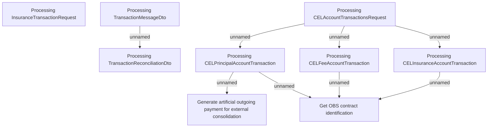

# Account Transactions - Business rules

- **Diagram Type**: Custom
- **Package**: HomerSelect/BSL/Modules/CBS Adapter/Analysis model/Account Transactions/Business rules
- **Diagram ID**: 107594
- **Elements**: 9
- **Connectors**: 8

