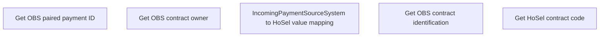

# COMMON for CBSA - Business rules

```mermaid
graph TD
    Get_OBS_paired_payment_ID["Get OBS paired payment ID"]
    Get_OBS_contract_owner["Get OBS contract owner"]
    IncomingPaymentSourceSystem_to_HoSel_value_mapping["IncomingPaymentSourceSystem to HoSel value mapping"]
    Get_OBS_contract_identification["Get OBS contract identification"]
    Get_HoSel_contract_code["Get HoSel contract code"]
```
