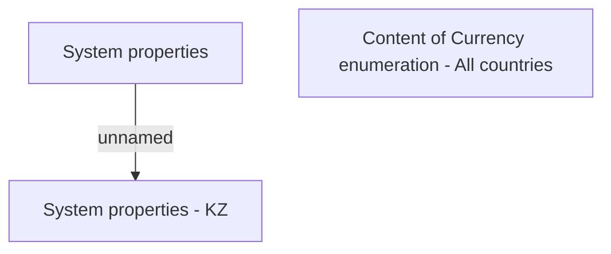

# Country specific settings - All countries

- **Diagram Type**: Custom
- **Package**: HomerSelect/BSL/Modules/CBS Adapter/Analysis model/COMMON for CBS Adapter/Country specific settings/All countries
- **Diagram ID**: 63274
- **Elements**: 3
- **Connectors**: 1

