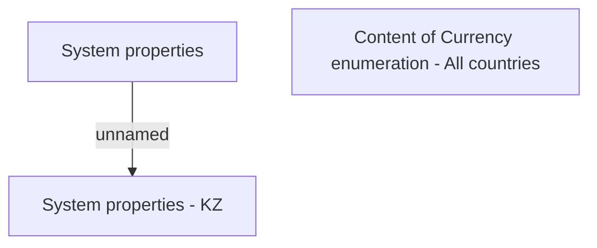

# Country specific settings - All countries

```mermaid
graph TD
    System_properties_KZ["System properties - KZ"]
    System_properties["System properties"]
    Content_of_Currency_enumeration_All_countries["Content of Currency enumeration - All countries"]
    System_properties -->|unnamed| System_properties_KZ
```
