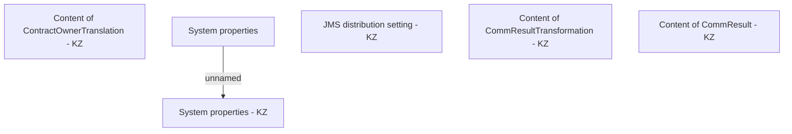

# COMMON for CBS Adapter - KZ setting

```mermaid
graph TD
    Content_of_ContractOwnerTranslation_KZ["Content of ContractOwnerTranslation - KZ"]
    System_properties["System properties"]
    System_properties_KZ["System properties - KZ"]
    JMS_distribution_setting_KZ["JMS distribution setting - KZ"]
    Content_of_CommResultTransformation_KZ["Content of CommResultTransformation - KZ"]
    Content_of_CommResult_KZ["Content of CommResult - KZ"]
    System_properties -->|unnamed| System_properties_KZ
```
