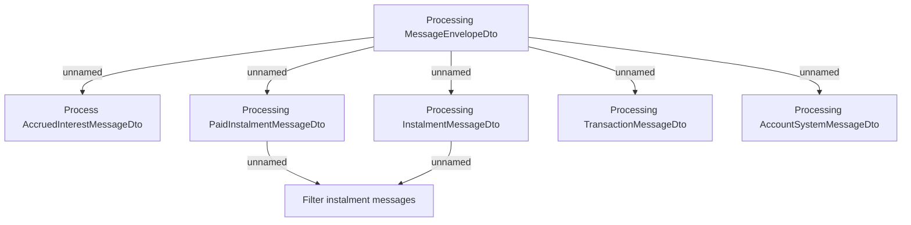

# COMMON for comm. with CaBus - Business rules

```mermaid
graph TD
    Process_AccruedInterestMessageDto["Process AccruedInterestMessageDto"]
    Filter_instalment_messages["Filter instalment messages"]
    Processing_InstalmentMessageDto["Processing InstalmentMessageDto"]
    Processing_PaidInstalmentMessageDto["Processing PaidInstalmentMessageDto"]
    Processing_TransactionMessageDto["Processing TransactionMessageDto"]
    Processing_AccountSystemMessageDto["Processing AccountSystemMessageDto"]
    Processing_MessageEnvelopeDto["Processing MessageEnvelopeDto
"]
    Processing_MessageEnvelopeDto -->|unnamed| Processing_TransactionMessageDto
    Processing_MessageEnvelopeDto -->|unnamed| Processing_AccountSystemMessageDto
    Processing_MessageEnvelopeDto -->|unnamed| Processing_InstalmentMessageDto
    Processing_MessageEnvelopeDto -->|unnamed| Process_AccruedInterestMessageDto
    Processing_MessageEnvelopeDto -->|unnamed| Processing_PaidInstalmentMessageDto
    Processing_PaidInstalmentMessageDto -->|unnamed| Filter_instalment_messages
    Processing_InstalmentMessageDto -->|unnamed| Filter_instalment_messages
```
