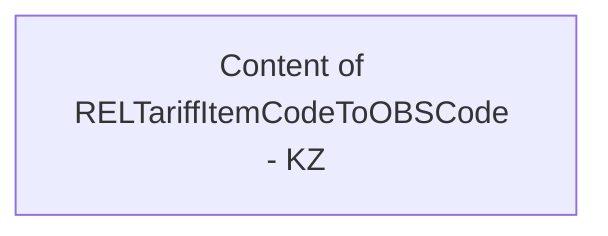

# COMMON for REL on CBS Adapter - KZ setting

- **Diagram Type**: Custom
- **Package**: HomerSelect/BSL/Modules/CBS Adapter/Analysis model/COMMON for communication with CaBus/Country specific settings/KZ
- **Diagram ID**: 96528
- **Elements**: 1
- **Connectors**: 0

