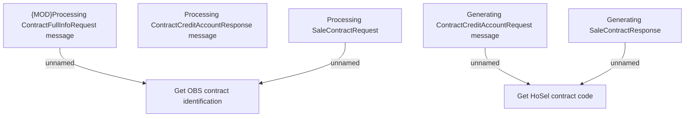

# Contract - Business rules

```mermaid
graph TD
    Get_HoSel_contract_code["Get HoSel contract code"]
    Get_OBS_contract_identification["Get OBS contract identification"]
    MOD_Processing_ContractFullInfoRequest_message["{MOD}Processing ContractFullInfoRequest message"]
    Processing_ContractCreditAccountResponse_message["Processing ContractCreditAccountResponse message"]
    Generating_ContractCreditAccountRequest_message["Generating ContractCreditAccountRequest message"]
    Generating_SaleContractResponse["Generating SaleContractResponse"]
    Processing_SaleContractRequest["Processing SaleContractRequest"]
    MOD_Processing_ContractFullInfoRequest_message -->|unnamed| Get_OBS_contract_identification
    Processing_SaleContractRequest -->|unnamed| Get_OBS_contract_identification
    Generating_ContractCreditAccountRequest_message -->|unnamed| Get_HoSel_contract_code
    Generating_SaleContractResponse -->|unnamed| Get_HoSel_contract_code
```
