# Incoming payments - Business rules

- **Diagram Type**: Custom
- **Package**: HomerSelect/BSL/Modules/CBS Adapter/Analysis model/Incoming Payments/Business rules
- **Diagram ID**: 98998
- **Elements**: 12
- **Connectors**: 11

```mermaid
graph TD
    Generate_outgoing_payment_for_consolidation["Generate outgoing payment for consolidation"]
    Filter_instalment_messages["Filter instalment messages"]
    Get_OBS_paired_payment_ID["Get OBS paired payment ID"]
    IncomingPaymentSourceSystem_to_HoSel_value_mapping["IncomingPaymentSourceSystem to HoSel value mapping"]
    Processing_PaidInstalmentMessageDto["Processing PaidInstalmentMessageDto"]
    Get_OBS_contract_identification["Get OBS contract identification"]
    Get_HoSel_contract_code["Get HoSel contract code"]
    Processing_ArtificialIncomingPaymentRequest["Processing ArtificialIncomingPaymentRequest"]
    Processing_PairedPaymentInfoDto["Processing PairedPaymentInfoDto"]
    Generating_IncomingPaymentRequest["Generating IncomingPaymentRequest"]
    Processing_IncomingPaymentResponse["Processing IncomingPaymentResponse"]
    Create_RESULT290_record_from_an_incoming_message["Create RESULT290 record from an incoming message"]
    Processing_IncomingPaymentResponse -->|unnamed| Create_RESULT290_record_from_an_incoming_message
    Generating_IncomingPaymentRequest -->|unnamed| IncomingPaymentSourceSystem_to_HoSel_value_mapping
    Generating_IncomingPaymentRequest -->|unnamed| Get_HoSel_contract_code
    Processing_PairedPaymentInfoDto -->|unnamed| IncomingPaymentSourceSystem_to_HoSel_value_mapping
    Processing_PairedPaymentInfoDto -->|unnamed| Get_OBS_contract_identification
    Processing_PairedPaymentInfoDto -->|unnamed| Get_OBS_paired_payment_ID
    Processing_ArtificialIncomingPaymentRequest -->|unnamed| Generate_outgoing_payment_for_consolidation
    Processing_ArtificialIncomingPaymentRequest -->|unnamed| Get_OBS_contract_identification
    Processing_ArtificialIncomingPaymentRequest -->|unnamed| IncomingPaymentSourceSystem_to_HoSel_value_mapping
    Processing_PaidInstalmentMessageDto -->|unnamed| IncomingPaymentSourceSystem_to_HoSel_value_mapping
    Processing_PaidInstalmentMessageDto -->|unnamed| Filter_instalment_messages
```

