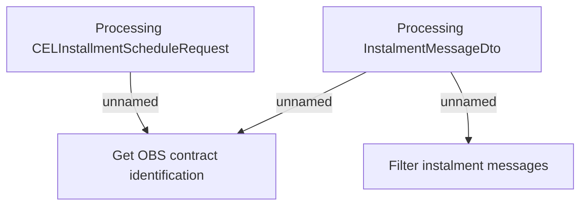

# Installment schedule - Business rules

- **Diagram Type**: Custom
- **Package**: HomerSelect/BSL/Modules/CBS Adapter/Analysis model/Installment Schedule/Business rules
- **Diagram ID**: 99016
- **Elements**: 4
- **Connectors**: 3

