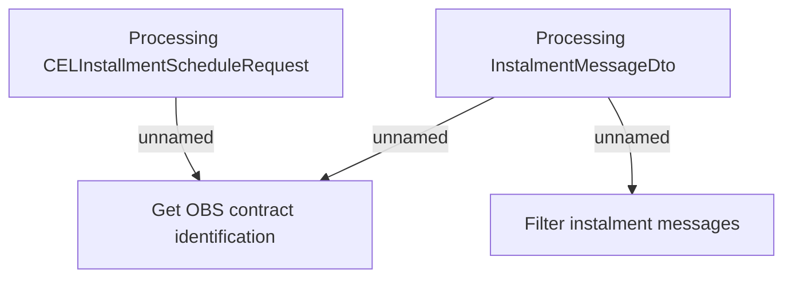

# Installment schedule - Business rules

```mermaid
graph TD
    Filter_instalment_messages["Filter instalment messages"]
    Get_OBS_contract_identification["Get OBS contract identification"]
    Processing_InstalmentMessageDto["Processing InstalmentMessageDto"]
    Processing_CELInstallmentScheduleRequest["Processing CELInstallmentScheduleRequest"]
    Processing_CELInstallmentScheduleRequest -->|unnamed| Get_OBS_contract_identification
    Processing_InstalmentMessageDto -->|unnamed| Get_OBS_contract_identification
    Processing_InstalmentMessageDto -->|unnamed| Filter_instalment_messages
```
