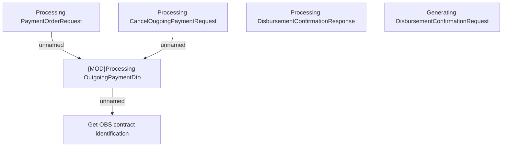

# Business rules

- **Diagram Type**: Custom
- **Package**: HomerSelect/BSL/Modules/CBS Adapter/Analysis model/Outgoing Payments/Business rules
- **Diagram ID**: 117341
- **Elements**: 6
- **Connectors**: 3

