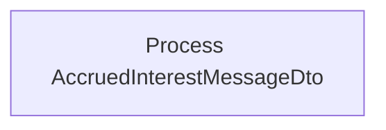

# REL Account Messages - Business rules

- **Diagram Type**: Custom
- **Package**: HomerSelect/BSL/Modules/CBS Adapter/Analysis model/REL Account Messages/Business rules
- **Diagram ID**: 98956
- **Elements**: 1
- **Connectors**: 0

