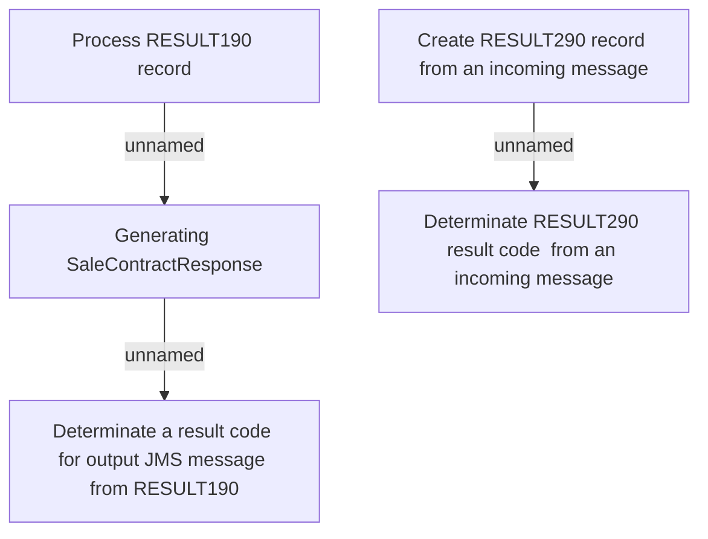

# Business rules

- **Diagram Type**: Custom
- **Package**: HomerSelect/BSL/Modules/CBS Adapter/Analysis model/RESULT tables/Business rules
- **Diagram ID**: 62750
- **Elements**: 5
- **Connectors**: 3

