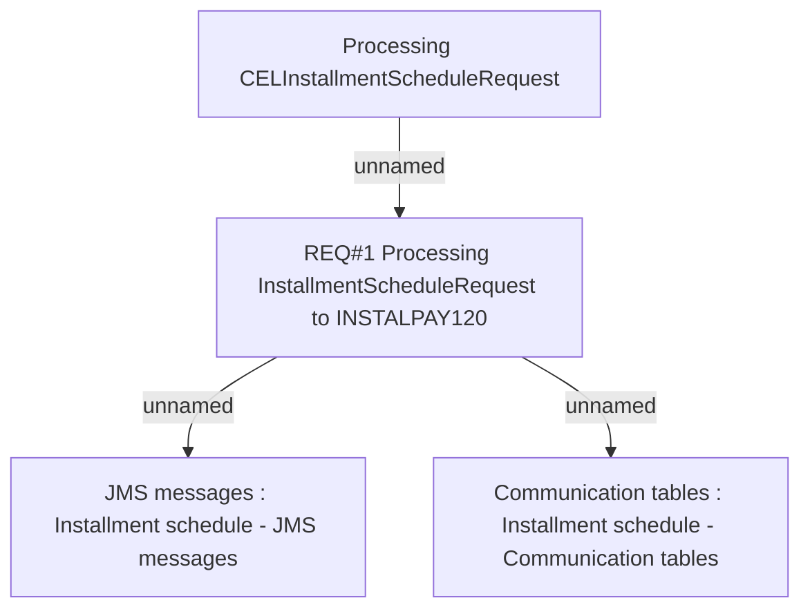

# BRR-2202 - OBS interface - Installment schedule (CEL)

```mermaid
graph TD
    Processing_CELInstallmentScheduleRequest["Processing CELInstallmentScheduleRequest"]
    JMS_messages_Installment_schedule_JMS_messages["JMS messages : Installment schedule - JMS messages"]
    Communication_tables_Installment_schedule_Communication_tabl["Communication tables : Installment schedule - Communication tables"]
    REQ_1_Processing_InstallmentScheduleRequest_to_INSTALPAY120["REQ#1 Processing InstallmentScheduleRequest to INSTALPAY120"]
    REQ_1_Processing_InstallmentScheduleRequest_to_INSTALPAY120 -->|unnamed| JMS_messages_Installment_schedule_JMS_messages
    REQ_1_Processing_InstallmentScheduleRequest_to_INSTALPAY120 -->|unnamed| Communication_tables_Installment_schedule_Communication_tabl
    Processing_CELInstallmentScheduleRequest -->|unnamed| REQ_1_Processing_InstallmentScheduleRequest_to_INSTALPAY120
```
