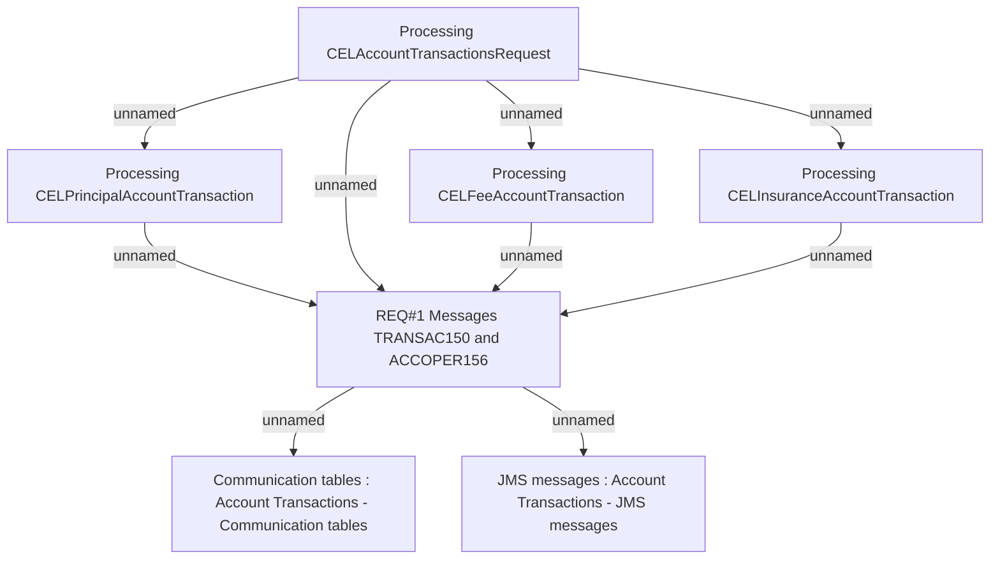

# BRR-2203 - OBS interface - Transactions on contracts (CEL)

- **Diagram Type**: Custom
- **Package**: HomerSelect/BSL/Modules/CBS Adapter/Requirements Model/BRR/Finished - HoSel 3.0/BRR-2203 - OBS interface - Transactions on contracts (CEL)
- **Diagram ID**: 63288
- **Elements**: 7
- **Connectors**: 9

