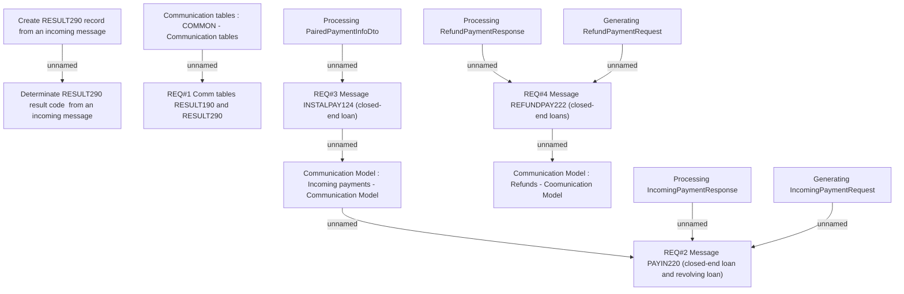

# BRR-2204 - OBS interface - Incoming payments

```mermaid
graph TD
    Communication_tables_COMMON_Communication_tables["Communication tables : COMMON - Communication tables"]
    Determinate_RESULT290_result_code_from_an_incoming_message["Determinate RESULT290 result code  from an incoming message "]
    Create_RESULT290_record_from_an_incoming_message["Create RESULT290 record from an incoming message"]
    REQ_1_Comm_tables_RESULT190_and_RESULT290["REQ#1 Comm tables RESULT190 and RESULT290"]
    Communication_Model_Incoming_payments_Communication_Model["Communication Model : Incoming payments - Communication Model"]
    Communication_Model_Refunds_Coomunication_Model["Communication Model : Refunds - Coomunication Model"]
    Processing_RefundPaymentResponse["Processing RefundPaymentResponse"]
    Generating_RefundPaymentRequest["Generating RefundPaymentRequest "]
    Processing_PairedPaymentInfoDto["Processing PairedPaymentInfoDto"]
    Processing_IncomingPaymentResponse["Processing IncomingPaymentResponse"]
    Generating_IncomingPaymentRequest["Generating IncomingPaymentRequest"]
    REQ_4_Message_REFUNDPAY222_closed_end_loans["REQ#4 Message REFUNDPAY222 (closed-end loans)"]
    REQ_3_Message_INSTALPAY124_closed_end_loan["REQ#3 Message INSTALPAY124 (closed-end loan)"]
    REQ_2_Message_PAYIN220_closed_end_loan_and_revolving_loan["REQ#2 Message PAYIN220 (closed-end loan and revolving loan)"]
    Create_RESULT290_record_from_an_incoming_message -->|unnamed| Determinate_RESULT290_result_code_from_an_incoming_message
    Communication_tables_COMMON_Communication_tables -->|unnamed| REQ_1_Comm_tables_RESULT190_and_RESULT290
    REQ_3_Message_INSTALPAY124_closed_end_loan -->|unnamed| Communication_Model_Incoming_payments_Communication_Model
    REQ_4_Message_REFUNDPAY222_closed_end_loans -->|unnamed| Communication_Model_Refunds_Coomunication_Model
    Communication_Model_Incoming_payments_Communication_Model -->|unnamed| REQ_2_Message_PAYIN220_closed_end_loan_and_revolving_loan
    Processing_PairedPaymentInfoDto -->|unnamed| REQ_3_Message_INSTALPAY124_closed_end_loan
    Processing_IncomingPaymentResponse -->|unnamed| REQ_2_Message_PAYIN220_closed_end_loan_and_revolving_loan
    Generating_IncomingPaymentRequest -->|unnamed| REQ_2_Message_PAYIN220_closed_end_loan_and_revolving_loan
    Processing_RefundPaymentResponse -->|unnamed| REQ_4_Message_REFUNDPAY222_closed_end_loans
    Generating_RefundPaymentRequest -->|unnamed| REQ_4_Message_REFUNDPAY222_closed_end_loans
```
