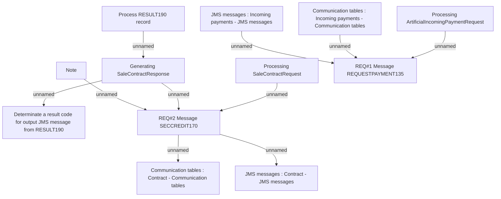

# BRR-2205 - OBS interface - Operations on contract (CEL)

```mermaid
graph TD
    el_821309["Note"]
    Determinate_a_result_code_for_output_JMS_message_from_RESULT["Determinate a result code for output JMS message from RESULT190"]
    Process_RESULT190_record["Process RESULT190 record"]
    Generating_SaleContractResponse["Generating SaleContractResponse"]
    Processing_SaleContractRequest["Processing SaleContractRequest"]
    JMS_messages_Contract_JMS_messages["JMS messages : Contract - JMS messages"]
    Communication_tables_Contract_Communication_tables["Communication tables : Contract - Communication tables"]
    REQ_2_Message_SECCREDIT170["REQ#2 Message SECCREDIT170"]
    REQ_1_Message_REQUESTPAYMENT135["REQ#1 Message REQUESTPAYMENT135"]
    JMS_messages_Incoming_payments_JMS_messages["JMS messages : Incoming payments - JMS messages"]
    Communication_tables_Incoming_payments_Communication_tables["Communication tables : Incoming payments - Communication tables"]
    Processing_ArtificialIncomingPaymentRequest["Processing ArtificialIncomingPaymentRequest"]
    JMS_messages_Incoming_payments_JMS_messages -->|unnamed| REQ_1_Message_REQUESTPAYMENT135
    Communication_tables_Incoming_payments_Communication_tables -->|unnamed| REQ_1_Message_REQUESTPAYMENT135
    el_821309 -->|unnamed| REQ_2_Message_SECCREDIT170
    REQ_2_Message_SECCREDIT170 -->|unnamed| Communication_tables_Contract_Communication_tables
    REQ_2_Message_SECCREDIT170 -->|unnamed| JMS_messages_Contract_JMS_messages
    Process_RESULT190_record -->|unnamed| Generating_SaleContractResponse
    Processing_ArtificialIncomingPaymentRequest -->|unnamed| REQ_1_Message_REQUESTPAYMENT135
    Generating_SaleContractResponse -->|unnamed| Determinate_a_result_code_for_output_JMS_message_from_RESULT
    Generating_SaleContractResponse -->|unnamed| REQ_2_Message_SECCREDIT170
    Processing_SaleContractRequest -->|unnamed| REQ_2_Message_SECCREDIT170
```
