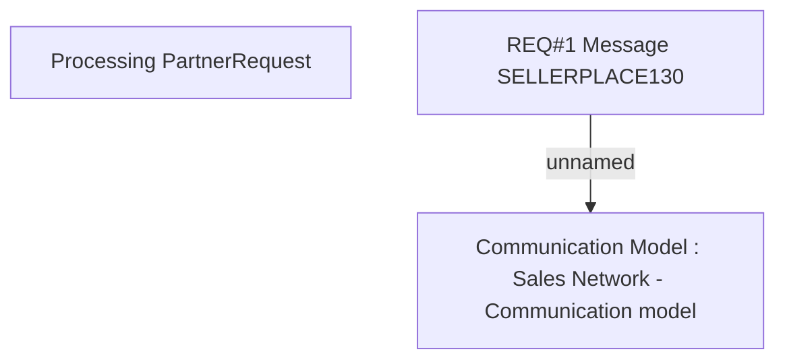

# BRR-2206 - OBS interface - Sales network

```mermaid
graph TD
    Communication_Model_Sales_Network_Communication_model["Communication Model : Sales Network - Communication model"]
    Processing_PartnerRequest["Processing PartnerRequest"]
    REQ_1_Message_SELLERPLACE130["REQ#1 Message SELLERPLACE130"]
    REQ_1_Message_SELLERPLACE130 -->|unnamed| Communication_Model_Sales_Network_Communication_model
```
