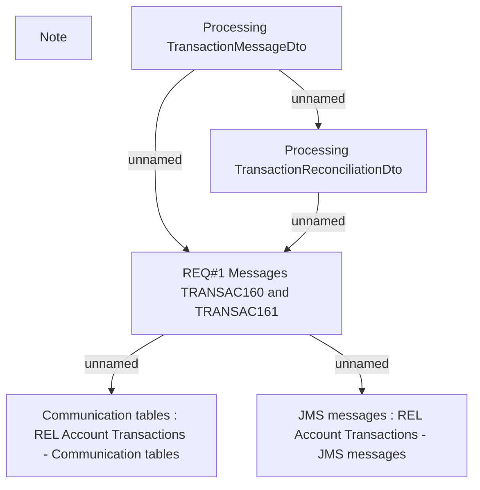

# BRR-2348 - OBS interface - Transactions on contracts (REL)

```mermaid
graph TD
    Communication_tables_REL_Account_Transactions_Communication_["Communication tables : REL Account Transactions - Communication tables"]
    el_821293["Note"]
    Processing_TransactionReconciliationDto["Processing TransactionReconciliationDto"]
    Processing_TransactionMessageDto["Processing TransactionMessageDto"]
    REQ_1_Messages_TRANSAC160_and_TRANSAC161["REQ#1 Messages TRANSAC160 and TRANSAC161"]
    JMS_messages_REL_Account_Transactions_JMS_messages["JMS messages : REL Account Transactions - JMS messages"]
    REQ_1_Messages_TRANSAC160_and_TRANSAC161 -->|unnamed| Communication_tables_REL_Account_Transactions_Communication_
    REQ_1_Messages_TRANSAC160_and_TRANSAC161 -->|unnamed| JMS_messages_REL_Account_Transactions_JMS_messages
    Processing_TransactionMessageDto -->|unnamed| Processing_TransactionReconciliationDto
    Processing_TransactionMessageDto -->|unnamed| REQ_1_Messages_TRANSAC160_and_TRANSAC161
    Processing_TransactionReconciliationDto -->|unnamed| REQ_1_Messages_TRANSAC160_and_TRANSAC161
```
