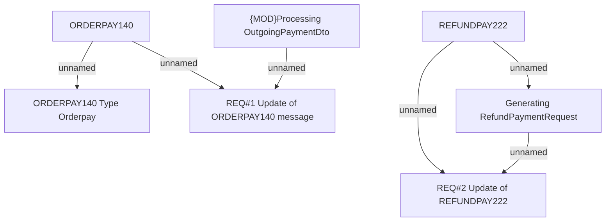

# BRR-2350 - OBS interface - Operations on contract (REL)

```mermaid
graph TD
    ORDERPAY140_Type_Orderpay["ORDERPAY140 Type Orderpay"]
    Generating_RefundPaymentRequest["Generating RefundPaymentRequest "]
    REFUNDPAY222["REFUNDPAY222"]
    REQ_2_Update_of_REFUNDPAY222["REQ#2 Update of REFUNDPAY222"]
    MOD_Processing_OutgoingPaymentDto["{MOD}Processing OutgoingPaymentDto"]
    ORDERPAY140["ORDERPAY140"]
    REQ_1_Update_of_ORDERPAY140_message["REQ#1 Update of ORDERPAY140 message"]
    REFUNDPAY222 -->|unnamed| REQ_2_Update_of_REFUNDPAY222
    REFUNDPAY222 -->|unnamed| Generating_RefundPaymentRequest
    MOD_Processing_OutgoingPaymentDto -->|unnamed| REQ_1_Update_of_ORDERPAY140_message
    ORDERPAY140 -->|unnamed| ORDERPAY140_Type_Orderpay
    ORDERPAY140 -->|unnamed| REQ_1_Update_of_ORDERPAY140_message
    Generating_RefundPaymentRequest -->|unnamed| REQ_2_Update_of_REFUNDPAY222
```
