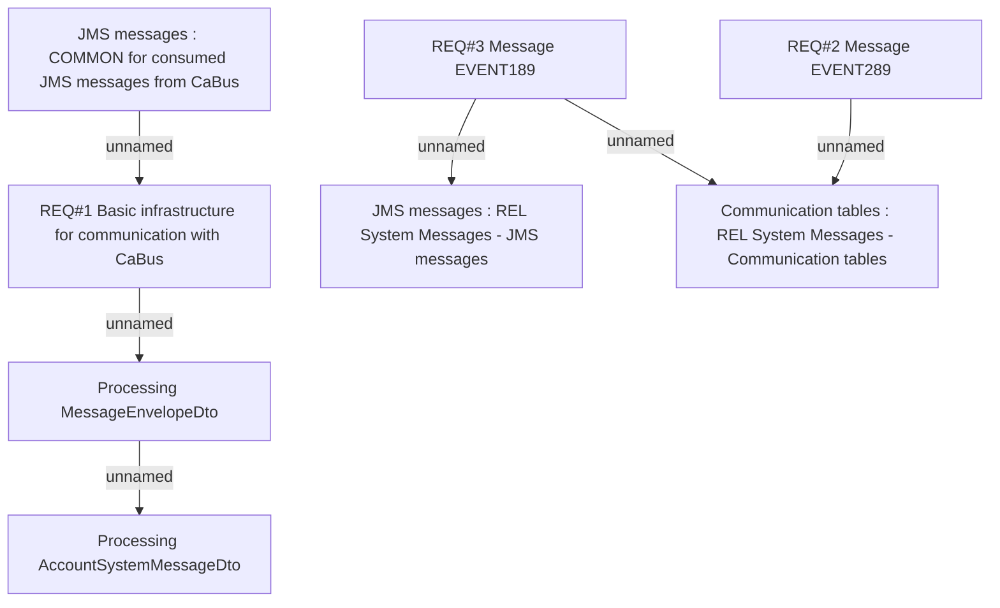

# BRR-2352 - OBS interface - System messages (REL)

```mermaid
graph TD
    REQ_2_Message_EVENT289["REQ#2 Message EVENT289"]
    JMS_messages_COMMON_for_consumed_JMS_messages_from_CaBus["JMS messages : COMMON for consumed JMS messages from CaBus"]
    Processing_MessageEnvelopeDto["Processing MessageEnvelopeDto
"]
    REQ_1_Basic_infrastructure_for_communication_with_CaBus["REQ#1 Basic infrastructure for communication with CaBus"]
    Processing_AccountSystemMessageDto["Processing AccountSystemMessageDto"]
    JMS_messages_REL_System_Messages_JMS_messages["JMS messages : REL System Messages - JMS messages"]
    Communication_tables_REL_System_Messages_Communication_table["Communication tables : REL System Messages - Communication tables"]
    REQ_3_Message_EVENT189["REQ#3 Message EVENT189"]
    REQ_2_Message_EVENT289 -->|unnamed| Communication_tables_REL_System_Messages_Communication_table
    REQ_3_Message_EVENT189 -->|unnamed| JMS_messages_REL_System_Messages_JMS_messages
    REQ_3_Message_EVENT189 -->|unnamed| Communication_tables_REL_System_Messages_Communication_table
    REQ_1_Basic_infrastructure_for_communication_with_CaBus -->|unnamed| Processing_MessageEnvelopeDto
    JMS_messages_COMMON_for_consumed_JMS_messages_from_CaBus -->|unnamed| REQ_1_Basic_infrastructure_for_communication_with_CaBus
    Processing_MessageEnvelopeDto -->|unnamed| Processing_AccountSystemMessageDto
```
