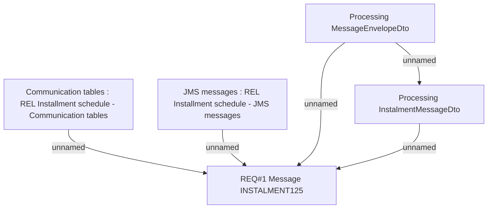

# BRR-2353 - OBS interface - Installment schedule (REL)

- **Diagram Type**: Custom
- **Package**: HomerSelect/BSL/Modules/CBS Adapter/Requirements Model/BRR/Finished - HoSel 3.0/BRR-2353 - OBS interface - Installment schedule (REL)
- **Diagram ID**: 63294
- **Elements**: 5
- **Connectors**: 5

