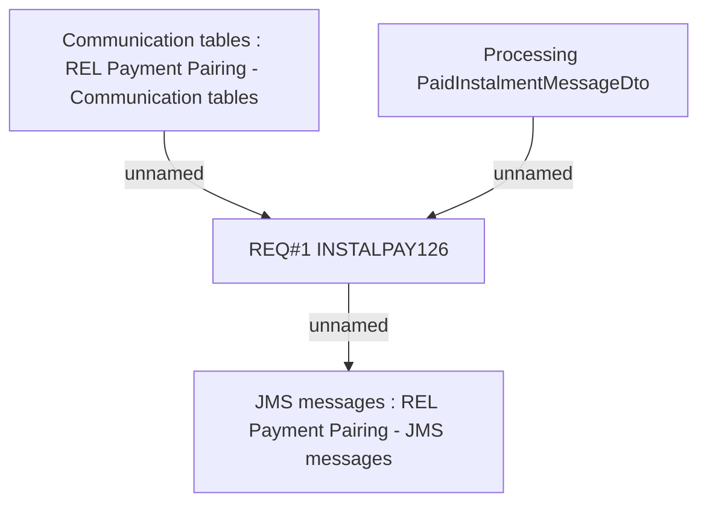

# BRR-2358 - OBS interface - Incoming payments (REL)

- **Diagram Type**: Custom
- **Package**: HomerSelect/BSL/Modules/CBS Adapter/Requirements Model/BRR/Finished - HoSel 3.0/BRR-2358 - OBS interface - Incoming payments (REL)
- **Diagram ID**: 63295
- **Elements**: 4
- **Connectors**: 3

