# BRR-2996 - ChR - OBS interface - Updates in communication regarding payments

- **Diagram Type**: Custom
- **Package**: HomerSelect/BSL/Modules/CBS Adapter/Requirements Model/BRR/Finished - HoSel 3.0/BRR-2996 - ChR - OBS interface - Updates in communication regarding payments
- **Diagram ID**: 63296
- **Elements**: 29
- **Connectors**: 37

```mermaid
graph TD
    Logical_Data_Model_COMMON_for_CBSA_LDM["Logical Data Model : COMMON for CBSA - LDM"]
    Generating_ContractCreditAccountRequest_message["Generating ContractCreditAccountRequest message"]
    Generating_SaleContractResponse["Generating SaleContractResponse"]
    MOD_Processing_ContractFullInfoRequest_message["{MOD}Processing ContractFullInfoRequest message"]
    Processing_SaleContractRequest["Processing SaleContractRequest"]
    Processing_CELInstallmentScheduleRequest["Processing CELInstallmentScheduleRequest"]
    MOD_Processing_OutgoingPaymentDto["{MOD}Processing OutgoingPaymentDto"]
    Generating_RefundPaymentRequest["Generating RefundPaymentRequest "]
    Get_OBS_contract_identification["Get OBS contract identification"]
    Get_HoSel_contract_code["Get HoSel contract code"]
    Communication_tables_Contract_Communication_tables["Communication tables : Contract - Communication tables"]
    JMS_messages_Pairing_Incoming_Payments_JMS_messages["JMS messages : Pairing Incoming Payments - JMS messages"]
    Processing_PairedPaymentInfoDto["Processing PairedPaymentInfoDto"]
    Communication_tables_Pairing_Incoming_payments_Communication["Communication tables : Pairing Incoming payments - Communication tables"]
    Generating_IncomingPaymentRequest["Generating IncomingPaymentRequest"]
    Communication_tables_Processing_Incoming_Payments_Communicat["Communication tables : Processing Incoming Payments - Communication tables"]
    JMS_messages_Processing_Incoming_payments_JMS_messages["JMS messages : Processing Incoming payments - JMS messages"]
    JMS_messages_Processing_Incoming_payments_JMS_messages["JMS messages :Processing Incoming payments - JMS messages"]
    Processing_ArtificialIncomingPaymentRequest["Processing ArtificialIncomingPaymentRequest"]
    Communication_Model_Processing_Incoming_Payments_Communicati["Communication Model : Processing Incoming Payments - Communication Model"]
    Communication_tables_CEL_Installment_schedule_Communication_["Communication tables : CEL Installment schedule - Communication tables"]
    Logical_Data_Model_COMMON_for_CBSA_LDM["Logical Data Model :COMMON for CBSA - LDM"]
    REQ_1_Unification_of_XXX_TypeInform_to_the_common_RecordType["REQ#1 Unification of XXX TypeInform to the common RecordTypeInform + related change in INSTALMENT120 + new dataType IncomingPaymentSourceSystem"]
    REQ_7_Translate_contract_codes_to_contract_DB_ID_for_migrate["REQ#7 Translate contract codes to contract DB ID for migrated contracts"]
    REQ_6_Report_of_not_created_artificial_payments["REQ#6 Report of not created artificial payments"]
    REQ_5_Update_SECCREDIT170_message["REQ#5 Update SECCREDIT170 message"]
    REQ_4_Add_paymentSource_to_the_INSTALPAY_124_messages["REQ#4 Add paymentSource to the INSTALPAY 124 messages"]
    REQ_3_Update_PAYIN220["REQ#3 Update PAYIN220"]
    REQ_2_Update_message_REQUESTPAYMENT135["REQ#2 Update message REQUESTPAYMENT135 "]
    REQ_1_Unification_of_XXX_TypeInform_to_the_common_RecordType -->|unnamed| Logical_Data_Model_COMMON_for_CBSA_LDM
    REQ_1_Unification_of_XXX_TypeInform_to_the_common_RecordType -->|unnamed| Communication_tables_CEL_Installment_schedule_Communication_
    REQ_2_Update_message_REQUESTPAYMENT135 -->|unnamed| Communication_Model_Processing_Incoming_Payments_Communicati
    REQ_4_Add_paymentSource_to_the_INSTALPAY_124_messages -->|unnamed| Communication_tables_Pairing_Incoming_payments_Communication
    REQ_5_Update_SECCREDIT170_message -->|unnamed| Communication_tables_Contract_Communication_tables
    JMS_messages_Processing_Incoming_payments_JMS_messages -->|unnamed| REQ_2_Update_message_REQUESTPAYMENT135
    JMS_messages_Processing_Incoming_payments_JMS_messages -->|unnamed| REQ_3_Update_PAYIN220
    Communication_tables_Processing_Incoming_Payments_Communicat -->|unnamed| REQ_3_Update_PAYIN220
    JMS_messages_Pairing_Incoming_Payments_JMS_messages -->|unnamed| REQ_4_Add_paymentSource_to_the_INSTALPAY_124_messages
    Logical_Data_Model_COMMON_for_CBSA_LDM -->|unnamed| REQ_7_Translate_contract_codes_to_contract_DB_ID_for_migrate
    Processing_PairedPaymentInfoDto -->|unnamed| REQ_7_Translate_contract_codes_to_contract_DB_ID_for_migrate
    Processing_PairedPaymentInfoDto -->|unnamed| REQ_4_Add_paymentSource_to_the_INSTALPAY_124_messages
    Processing_PairedPaymentInfoDto -->|unnamed| Get_OBS_contract_identification
    Generating_IncomingPaymentRequest -->|unnamed| REQ_7_Translate_contract_codes_to_contract_DB_ID_for_migrate
    Generating_IncomingPaymentRequest -->|unnamed| REQ_3_Update_PAYIN220
    Generating_IncomingPaymentRequest -->|unnamed| Get_HoSel_contract_code
    Processing_ArtificialIncomingPaymentRequest -->|unnamed| Get_OBS_contract_identification
    Processing_ArtificialIncomingPaymentRequest -->|unnamed| REQ_7_Translate_contract_codes_to_contract_DB_ID_for_migrate
    Processing_ArtificialIncomingPaymentRequest -->|unnamed| REQ_2_Update_message_REQUESTPAYMENT135
    Generating_ContractCreditAccountRequest_message -->|unnamed| REQ_7_Translate_contract_codes_to_contract_DB_ID_for_migrate
    Generating_ContractCreditAccountRequest_message -->|unnamed| Get_HoSel_contract_code
    Generating_SaleContractResponse -->|unnamed| REQ_7_Translate_contract_codes_to_contract_DB_ID_for_migrate
    Generating_SaleContractResponse -->|unnamed| Get_HoSel_contract_code
    Generating_SaleContractResponse -->|unnamed| REQ_5_Update_SECCREDIT170_message
    MOD_Processing_ContractFullInfoRequest_message -->|unnamed| Get_OBS_contract_identification
    MOD_Processing_ContractFullInfoRequest_message -->|unnamed| REQ_7_Translate_contract_codes_to_contract_DB_ID_for_migrate
    Processing_SaleContractRequest -->|unnamed| Get_OBS_contract_identification
    Processing_SaleContractRequest -->|unnamed| REQ_7_Translate_contract_codes_to_contract_DB_ID_for_migrate
    Processing_SaleContractRequest -->|unnamed| REQ_5_Update_SECCREDIT170_message
    MOD_Processing_OutgoingPaymentDto -->|unnamed| Get_OBS_contract_identification
    MOD_Processing_OutgoingPaymentDto -->|unnamed| REQ_7_Translate_contract_codes_to_contract_DB_ID_for_migrate
    Processing_CELInstallmentScheduleRequest -->|unnamed| REQ_7_Translate_contract_codes_to_contract_DB_ID_for_migrate
    Processing_CELInstallmentScheduleRequest -->|unnamed| Get_OBS_contract_identification
    Get_OBS_contract_identification -->|unnamed| REQ_7_Translate_contract_codes_to_contract_DB_ID_for_migrate
    Get_HoSel_contract_code -->|unnamed| REQ_7_Translate_contract_codes_to_contract_DB_ID_for_migrate
    Generating_RefundPaymentRequest -->|unnamed| Get_HoSel_contract_code
    Generating_RefundPaymentRequest -->|unnamed| REQ_7_Translate_contract_codes_to_contract_DB_ID_for_migrate
```

