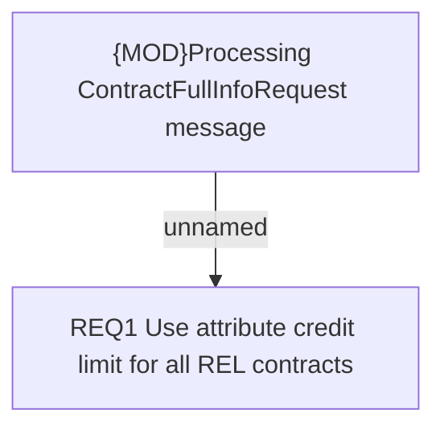

# BRR-3421 ChR - Send credit limit in Credit110 to OBS for REL contracts

- **Diagram Type**: Custom
- **Package**: HomerSelect/BSL/Modules/CBS Adapter/Requirements Model/BRR/Finished - HoSel 3.0/BRR-3421 ChR - Send credit limit in Credit110 to OBS for REL contracts
- **Diagram ID**: 63297
- **Elements**: 2
- **Connectors**: 1

