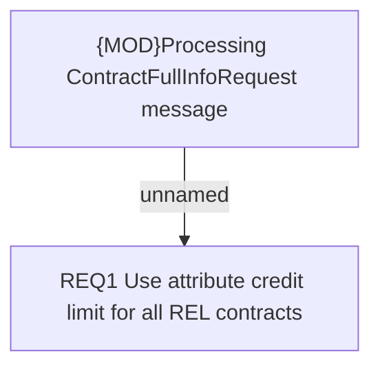

# BRR-3421 ChR - Send credit limit in Credit110 to OBS for REL contracts

```mermaid
graph TD
    REQ1_Use_attribute_credit_limit_for_all_REL_contracts["REQ1 Use attribute credit limit for all REL contracts"]
    MOD_Processing_ContractFullInfoRequest_message["{MOD}Processing ContractFullInfoRequest message"]
    MOD_Processing_ContractFullInfoRequest_message -->|unnamed| REQ1_Use_attribute_credit_limit_for_all_REL_contracts
```
