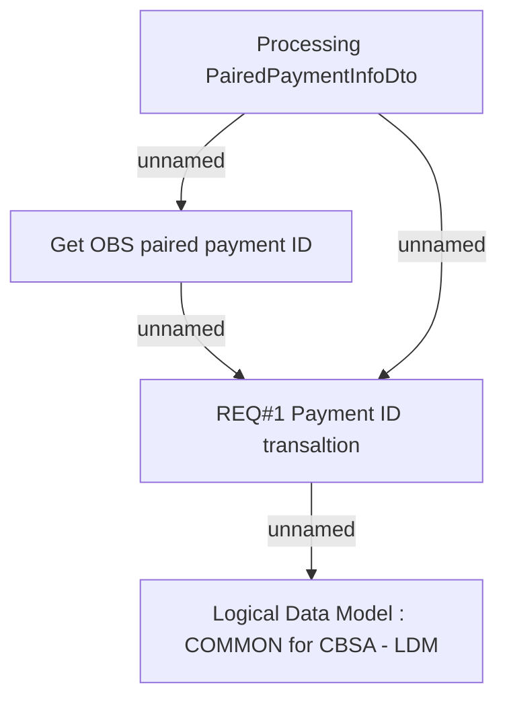

# BRR-3487 - Mapping of OBS payment ID to Homer ID

- **Diagram Type**: Custom
- **Package**: HomerSelect/BSL/Modules/CBS Adapter/Requirements Model/BRR/Finished - HoSel 3.0/BRR-3487 - Mapping of OBS payment ID to Homer ID
- **Diagram ID**: 62841
- **Elements**: 4
- **Connectors**: 4

