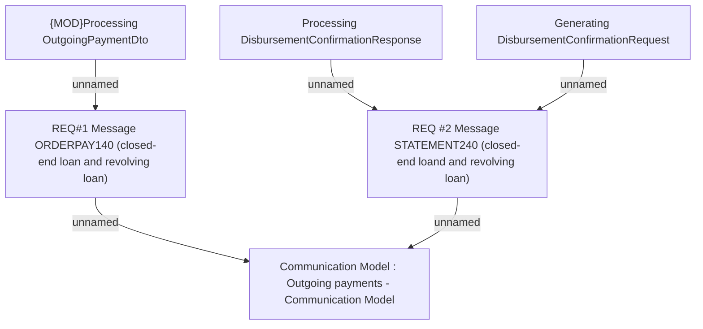

# BRR-570 - OBS interface - Outgoing payments

```mermaid
graph TD
    Processing_DisbursementConfirmationResponse["Processing DisbursementConfirmationResponse"]
    Communication_Model_Outgoing_payments_Communication_Model["Communication Model : Outgoing payments - Communication Model"]
    MOD_Processing_OutgoingPaymentDto["{MOD}Processing OutgoingPaymentDto"]
    Generating_DisbursementConfirmationRequest["Generating DisbursementConfirmationRequest "]
    REQ_2_Message_STATEMENT240_closed_end_loand_and_revolving_lo["REQ #2 Message STATEMENT240 (closed-end loand and revolving loan)"]
    REQ_1_Message_ORDERPAY140_closed_end_loan_and_revolving_loan["REQ#1 Message ORDERPAY140 (closed-end loan and revolving loan)"]
    REQ_1_Message_ORDERPAY140_closed_end_loan_and_revolving_loan -->|unnamed| Communication_Model_Outgoing_payments_Communication_Model
    REQ_2_Message_STATEMENT240_closed_end_loand_and_revolving_lo -->|unnamed| Communication_Model_Outgoing_payments_Communication_Model
    MOD_Processing_OutgoingPaymentDto -->|unnamed| REQ_1_Message_ORDERPAY140_closed_end_loan_and_revolving_loan
    Processing_DisbursementConfirmationResponse -->|unnamed| REQ_2_Message_STATEMENT240_closed_end_loand_and_revolving_lo
    Generating_DisbursementConfirmationRequest -->|unnamed| REQ_2_Message_STATEMENT240_closed_end_loand_and_revolving_lo
```
