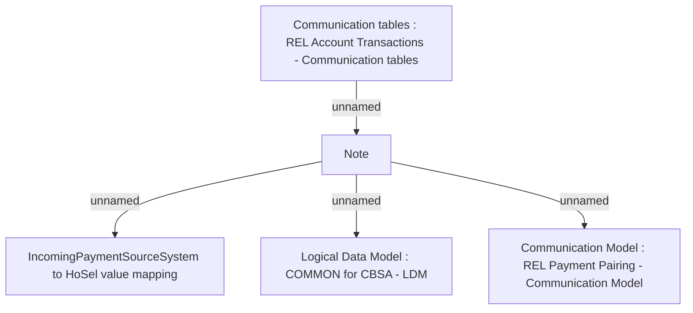

# CBL-1696 - New SystemCode LP - AccountTransactionWS 

- **Diagram Type**: Custom
- **Package**: HomerSelect/BSL/Modules/CBS Adapter/Requirements Model/CBL/CBL-1696 - New SystemCode LP - AccountTransactionWS 
- **Diagram ID**: 97643
- **Elements**: 5
- **Connectors**: 4

