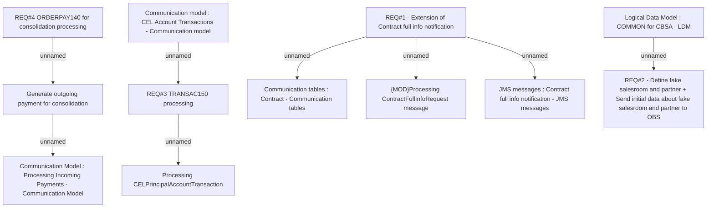

# CBL-817 - Change to BSL and CBSA module by consolidation process

```mermaid
graph TD
    Communication_Model_Processing_Incoming_Payments_Communicati["Communication Model : Processing Incoming Payments - Communication Model"]
    Generate_outgoing_payment_for_consolidation["Generate outgoing payment for consolidation"]
    REQ_4_ORDERPAY140_for_consolidation_processing["REQ#4 ORDERPAY140 for consolidation processing"]
    Communication_model_CEL_Account_Transactions_Communication_m["Communication model : CEL Account Transactions - Communication model"]
    Logical_Data_Model_COMMON_for_CBSA_LDM["Logical Data Model : COMMON for CBSA - LDM"]
    Processing_CELPrincipalAccountTransaction["Processing CELPrincipalAccountTransaction"]
    REQ_3_TRANSAC150_processing["REQ#3 TRANSAC150 processing"]
    Communication_tables_Contract_Communication_tables["Communication tables : Contract - Communication tables"]
    MOD_Processing_ContractFullInfoRequest_message["{MOD}Processing ContractFullInfoRequest message"]
    JMS_messages_Contract_full_info_notification_JMS_messages["JMS messages : Contract full info notification - JMS messages"]
    REQ_1_Extension_of_Contract_full_info_notification["REQ#1 - Extension of Contract full info notification"]
    REQ_2_Define_fake_salesroom_and_partner_Send_initial_data_ab["REQ#2 - Define fake salesroom and partner + Send initial data about fake salesroom and partner to OBS"]
    REQ_4_ORDERPAY140_for_consolidation_processing -->|unnamed| Generate_outgoing_payment_for_consolidation
    Logical_Data_Model_COMMON_for_CBSA_LDM -->|unnamed| REQ_2_Define_fake_salesroom_and_partner_Send_initial_data_ab
    REQ_1_Extension_of_Contract_full_info_notification -->|unnamed| JMS_messages_Contract_full_info_notification_JMS_messages
    REQ_1_Extension_of_Contract_full_info_notification -->|unnamed| MOD_Processing_ContractFullInfoRequest_message
    REQ_1_Extension_of_Contract_full_info_notification -->|unnamed| Communication_tables_Contract_Communication_tables
    Communication_model_CEL_Account_Transactions_Communication_m -->|unnamed| REQ_3_TRANSAC150_processing
    REQ_3_TRANSAC150_processing -->|unnamed| Processing_CELPrincipalAccountTransaction
    Generate_outgoing_payment_for_consolidation -->|unnamed| Communication_Model_Processing_Incoming_Payments_Communicati
```
