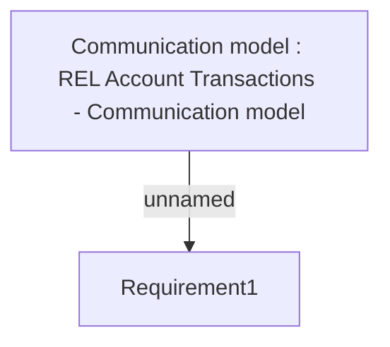

# IAKZ-624 TransacHead160 Upgrade

- **Diagram Type**: Custom
- **Package**: HomerSelect/BSL/Modules/CBS Adapter/Requirements Model/Others/IAKZ-624 TransacHead160 Upgrade
- **Diagram ID**: 77943
- **Elements**: 2
- **Connectors**: 1

