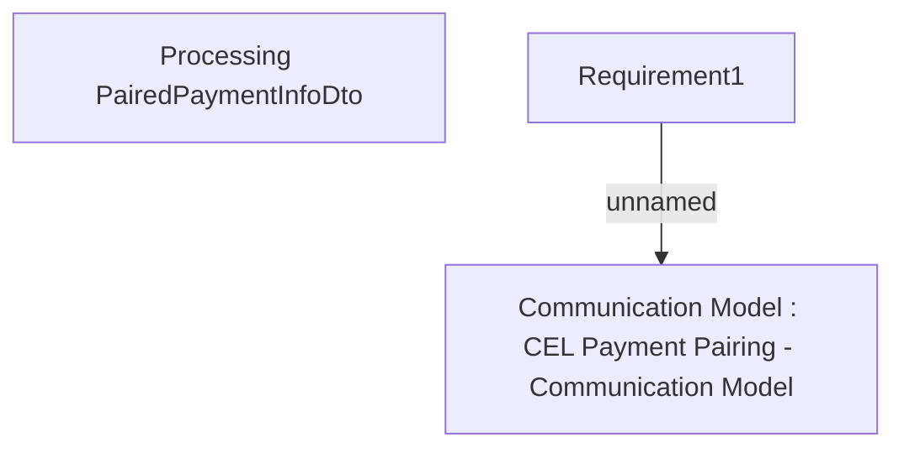

# IAKZ-631 - Not sending instalpay124 with current contract status H to OBS

- **Diagram Type**: Custom
- **Package**: HomerSelect/BSL/Modules/CBS Adapter/Requirements Model/Others/IAKZ-631 - Not sending instalpay124 with current contract status H to OBS
- **Diagram ID**: 77944
- **Elements**: 3
- **Connectors**: 1

