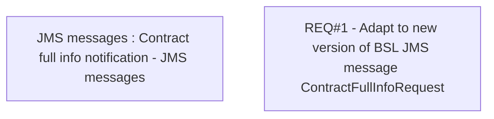

# PBR-1058 Removal of critical dependency of Loxon on DWH - part 2

```mermaid
graph TD
    JMS_messages_Contract_full_info_notification_JMS_messages["JMS messages : Contract full info notification - JMS messages"]
    REQ_1_Adapt_to_new_version_of_BSL_JMS_message_ContractFullIn["REQ#1 - Adapt to new version of BSL JMS message ContractFullInfoRequest"]
```
