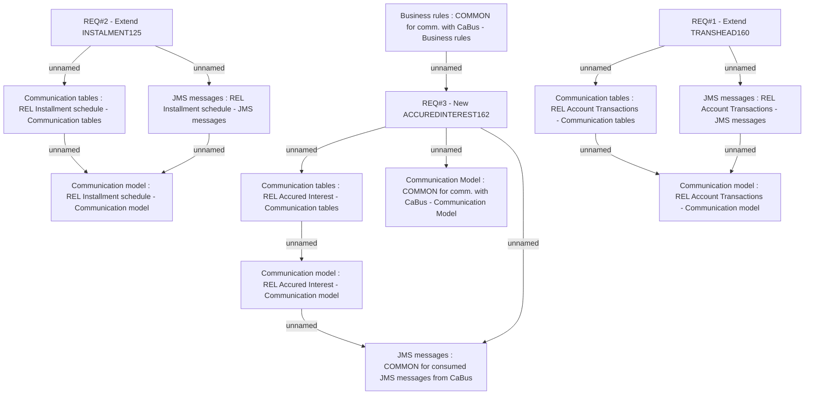

# PBR-1132 - HoSel/OBS interface changes for ICT

```mermaid
graph TD
    Communication_model_REL_Installment_schedule_Communication_m["Communication model : REL Installment schedule - Communication model"]
    Communication_model_REL_Accured_Interest_Communication_model["Communication model : REL Accured Interest - Communication model"]
    Communication_tables_REL_Accured_Interest_Communication_tabl["Communication tables : REL Accured Interest - Communication tables"]
    Business_rules_COMMON_for_comm_with_CaBus_Business_rules["Business rules : COMMON for comm. with CaBus - Business rules"]
    Communication_Model_COMMON_for_comm_with_CaBus_Communication["Communication Model : COMMON for comm. with CaBus - Communication Model"]
    JMS_messages_COMMON_for_consumed_JMS_messages_from_CaBus["JMS messages : COMMON for consumed JMS messages from CaBus"]
    Communication_tables_REL_Account_Transactions_Communication_["Communication tables : REL Account Transactions - Communication tables"]
    Communication_tables_REL_Installment_schedule_Communication_["Communication tables : REL Installment schedule - Communication tables"]
    JMS_messages_REL_Installment_schedule_JMS_messages["JMS messages : REL Installment schedule - JMS messages"]
    Communication_model_REL_Account_Transactions_Communication_m["Communication model : REL Account Transactions - Communication model"]
    JMS_messages_REL_Account_Transactions_JMS_messages["JMS messages : REL Account Transactions - JMS messages"]
    REQ_3_New_ACCUREDINTEREST162["REQ#3 - New ACCUREDINTEREST162"]
    REQ_2_Extend_INSTALMENT125["REQ#2 - Extend INSTALMENT125"]
    REQ_1_Extend_TRANSHEAD160["REQ#1 - Extend TRANSHEAD160"]
    JMS_messages_REL_Installment_schedule_JMS_messages -->|unnamed| Communication_model_REL_Installment_schedule_Communication_m
    Communication_tables_REL_Installment_schedule_Communication_ -->|unnamed| Communication_model_REL_Installment_schedule_Communication_m
    Communication_tables_REL_Accured_Interest_Communication_tabl -->|unnamed| Communication_model_REL_Accured_Interest_Communication_model
    REQ_3_New_ACCUREDINTEREST162 -->|unnamed| Communication_tables_REL_Accured_Interest_Communication_tabl
    REQ_3_New_ACCUREDINTEREST162 -->|unnamed| Communication_Model_COMMON_for_comm_with_CaBus_Communication
    REQ_3_New_ACCUREDINTEREST162 -->|unnamed| JMS_messages_COMMON_for_consumed_JMS_messages_from_CaBus
    Communication_model_REL_Accured_Interest_Communication_model -->|unnamed| JMS_messages_COMMON_for_consumed_JMS_messages_from_CaBus
    REQ_1_Extend_TRANSHEAD160 -->|unnamed| Communication_tables_REL_Account_Transactions_Communication_
    REQ_2_Extend_INSTALMENT125 -->|unnamed| Communication_tables_REL_Installment_schedule_Communication_
    REQ_2_Extend_INSTALMENT125 -->|unnamed| JMS_messages_REL_Installment_schedule_JMS_messages
    JMS_messages_REL_Account_Transactions_JMS_messages -->|unnamed| Communication_model_REL_Account_Transactions_Communication_m
    Communication_tables_REL_Account_Transactions_Communication_ -->|unnamed| Communication_model_REL_Account_Transactions_Communication_m
    REQ_1_Extend_TRANSHEAD160 -->|unnamed| JMS_messages_REL_Account_Transactions_JMS_messages
    Business_rules_COMMON_for_comm_with_CaBus_Business_rules -->|unnamed| REQ_3_New_ACCUREDINTEREST162
```
