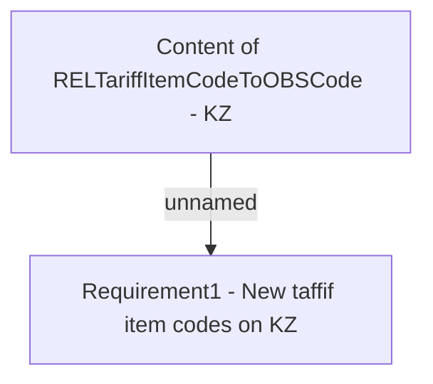

# PBR-1244 - Seizure on cards - Legal Patch 2

- **Diagram Type**: Custom
- **Package**: HomerSelect/BSL/Modules/CBS Adapter/Requirements Model/PBR/PBR-1244 - Seizure on cards - Legal Patch 2
- **Diagram ID**: 75448
- **Elements**: 2
- **Connectors**: 1

