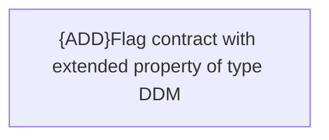

# Business rules

- **Diagram Type**: Custom
- **Package**: HomerSelect/BSL/Modules/CEL Account (CELA)/Analytical model/DDM validation/Business rules
- **Diagram ID**: 156127
- **Elements**: 1
- **Connectors**: 0

