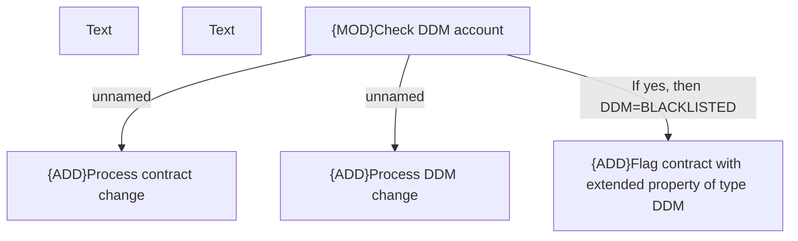

# CBL-19085 (CLM-5321) DDM validation - test & document

- **Diagram Type**: Custom
- **Package**: HomerSelect/BSL/Modules/CEL Account (CELA)/Requirements/CBL-19085 (CLM-5321) DDM validation - test & document/CLM-5321 - DDM validation - test & document
- **Diagram ID**: 156130
- **Elements**: 6
- **Connectors**: 3

